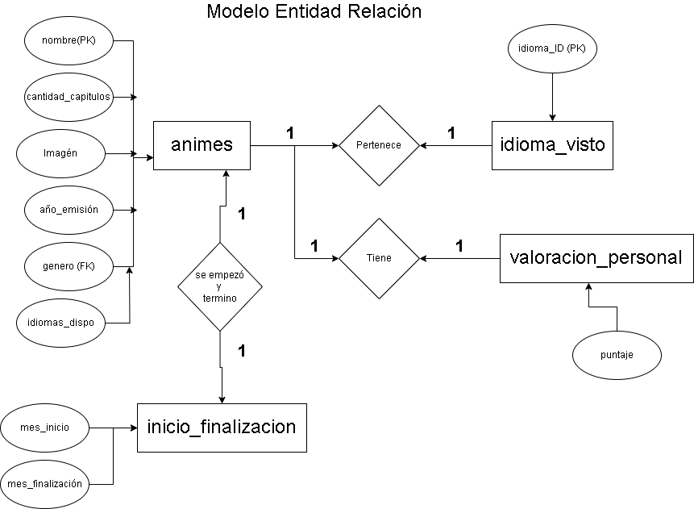
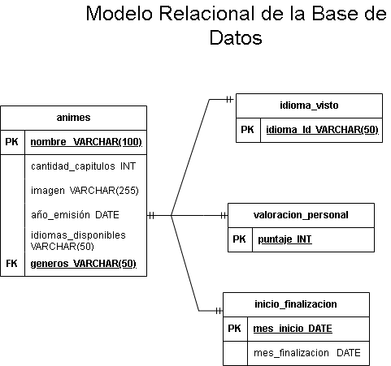

# Animes Terminados de ver

## Listado de Entidades

### animes  **ED**

- nombre  **(PK)**
- cantidad_capitulos
- foto
- año_emisión
- genero **(FK)**
- idiomas_disponibles

### inicio_finalizacion  **ED**

- mes.inicio
- mes.finalización

### valoración_personal  **ED**

- puntaje (rango de puntaje entre 0 y 10)

### idioma_visto  **ED**

- idioma_Id **(PK)**

## Relaciones

1. **animes** _pertenece_ a un **idioma_visto**   (_1 a 1_).
1. **animes** _se empezó y terminó_ en **inicio_finalizacion**   (_1 a 1_).
1. **animes** _tiene_ **valoracion_personal**. (_1 a 1_).

## Diagramas

### Modelo Entidad - Relación

### Modelo Entidad de la BD

## Reglas de Negocio

### animes

1. añadir un anime
1. actualizar los datos del anime
1. leer el registro de un anime en particular
1. añadir cantidad de capitulos
1. añadir genero
1. añadir el idioma en que se vio el anime, subtitulado/doblado
1. eliminar los datos de un anime dada una condición en particular

### valoracion_personal

1. añadir una valoración al anime del 1 al 10
1. eliminar valoración del anime
1. leer puntuación
1. eliminar puntuación
1. actualizar puntuación

### idioma_visto

1. añadir el idioma en que se vio el anime (máximo 2 idiomas)

### inicio_finalizacion

1. añadir el día, mes y año en que se vio el primer capítulo del anime
1. añadir el mes en que se finalizó de ver el anime
1. actualizar fecha de inicio y finalización del anime